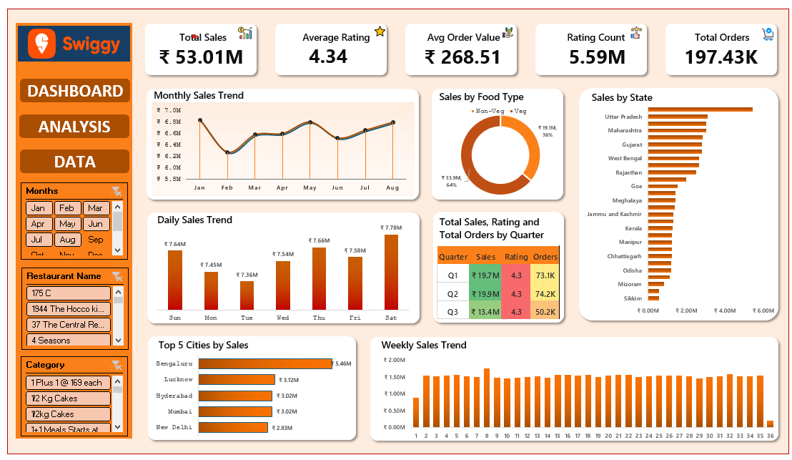

# Swiggy Sales Analysis Dashboard

## Overview
This project is an interactive sales analytics solution built in Microsoft Excel using Swiggy sales data. The dashboard provides insights into sales performance, customer ratings, order patterns, food preferences, and regional trends through dynamic visualizations and KPI tracking.

## Objectives
- Analyze overall sales performance.
- Track customer ratings and order behavior.
- Identify top-performing cities and states.
- Compare sales across food categories.
- Monitor monthly, weekly, and daily sales trends.

## Key Performance Indicators (KPIs)
- Total Sales: ₹53.01M
- Average Rating: 4.34
- Average Order Value (AOV): ₹268.51
- Rating Count: 5.59M
- Total Orders: 197.43K

## Dashboard Features
- Interactive slicers for Month, Restaurant Name, and Category.
- Monthly sales trend analysis.
- Daily and weekly sales performance tracking.
- Food type contribution analysis.
- State-wise sales comparison.
- Top 5 cities by sales visualization.
- Quarterly sales, ratings, and order analysis.
- Dynamic filtering for deeper business insights.

## Tools & Techniques Used
- Microsoft Excel
- Pivot Tables
- Pivot Charts
- Power Pivot
- Slicers
- Data Cleaning
- KPI Cards
- Data Visualization

## Business Insights
- Identified top-performing cities contributing the highest revenue.
- Evaluated customer satisfaction through rating analysis.
- Compared sales distribution across food categories.
- Tracked seasonal and quarterly performance patterns.
- Analyzed regional sales trends across multiple states.

## Project Structure
- Dashboard Sheet – Interactive business dashboard.
- Analysis Sheet – Detailed analytical views and trend analysis.
- Swiggy Data Sheet – Raw dataset used for reporting.

## Dashboard Preview

## Outcome
The project transforms raw transactional data into actionable business insights, enabling data-driven decision-making through an easy-to-use Excel dashboard.
